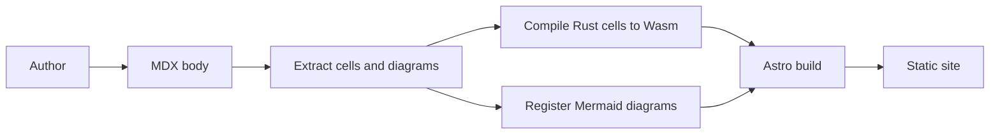
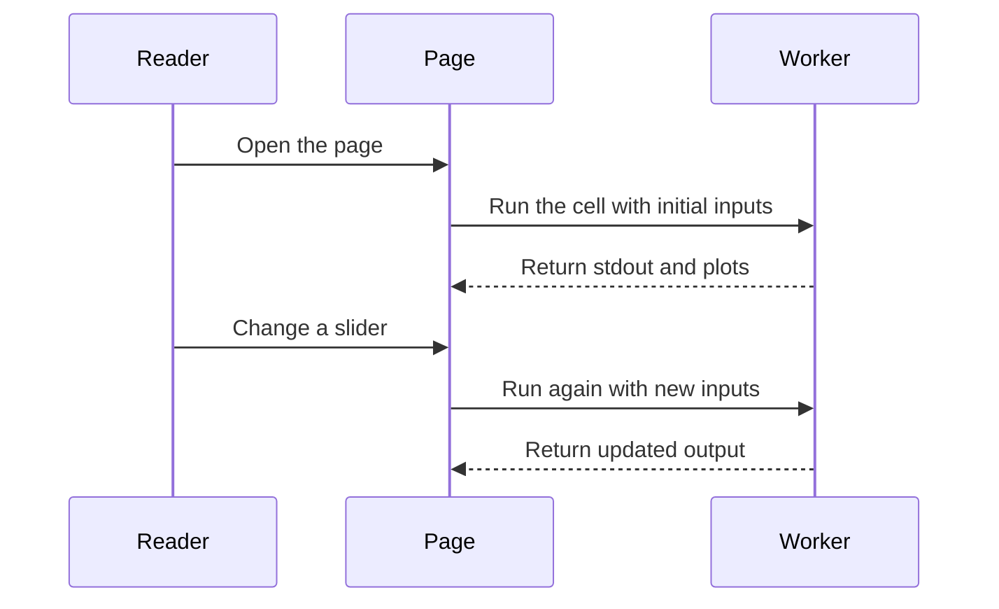
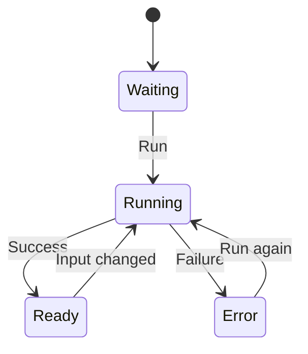

Mermaid is a text format for diagrams. In Oxiquill, a fenced `mermaid` block is converted into a browser-rendered SVG diagram. No imports or custom components are needed in the page.

## Build Flow

This flowchart shows how prose, executable cells, and static site generation fit together.

## Reader Flow

This sequence diagram shows how a reader opens a page and changes an input-driven cell.

## Cell States

This state diagram shows the main cell UI states.

Keep Mermaid source in repository-owned MDX and avoid rendering untrusted external input directly.
