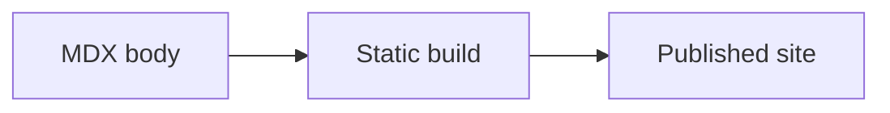

Oxiquill pages are MDX files. A page can be a plain prose note, a runnable computation, a media-rich explanation, or a mix of those forms.

## Add a Page

Every page starts with Starlight frontmatter. `title` is used for the page heading and sidebar label. `description` is used for metadata and search results.

```md
---
title: Page title
description: Explain the page in one sentence.
---

Write the body here.
```

Add English pages under `content/docs`. Add Japanese translations with the same route under `content/docs/ja`. Add pages to the sidebar in `astro.config.mjs` when they should be part of the primary navigation.

Good page locations:

- `guides/<topic>.mdx` for workflow documentation.
- `features/<feature>.mdx` for feature descriptions and examples.
- `samples/<topic>.mdx` for complete sample notes.

## Write for Readers

Start with what the page helps the reader do, then move into examples. Use headings to separate intent, syntax, and behavior. Keep sample cells deterministic so tests, screenshots, and readers see stable output.

Use the same route and general structure in Japanese translations. The Japanese page does not need to be word-for-word identical, but it should cover the same behavior and examples.

## Choose the Page Table of Contents

Regular pages show Starlight's table of contents. On desktop, readers can collapse the right column and Oxiquill remembers that choice for the current browser tab. On mobile, Starlight's existing disclosure remains unchanged.

Use `tableOfContents: false` in frontmatter when a page should have no table of contents or desktop control. Starlight splash pages also omit both automatically. This page-level setting is separate from the project-wide `desktopTableOfContentsToggle` option, which only enables or disables the desktop collapse control.

## Write Rust Cells

Rust cells are fenced `rust` code blocks with metadata in leading `//|` or `///|` comments. Metadata comments must form one contiguous block at the very start of the cell; later option-looking comments remain source code. The `id` must be unique within the page and match lowercase kebab-case. English and Japanese versions may reuse the same local `id`; the build creates page-scoped internal IDs.

````md
```rust
//| id: sample-rust-cell
//| title: Rust calculation
//| run: button
//| crates: [doc-rust]
let next = doc_rust::logistic_step(3.2, 0.2);
println!("next = {next:.6}");
```
````

Use `crates` to list helper crate package names under `crates/*`. Cells that do not need shared Rust logic should use `crates: []`.

## Write Python Cells

Python cells are fenced `python` code blocks with metadata in leading `#|` comments.

````md
```python
#| id: sample-python-cell
#| title: Python calculation
#| run: reactive
#| inputs:
#|   scale: { type: number, label: Scale, description: Multiplier from 1 through 10., min: 1, max: 10, step: 1, value: 2 }
print(scale * 10)
```
````

Python cells run in a Pyodide worker. If a cell needs vendored packages, list them with `packages`. Supported package names include `numpy`, `pandas`, `matplotlib`, and their vendored dependencies.

## Write Haskell Cells

Haskell cells are fenced `haskell` code blocks with metadata in leading `--|` comments. They compile to WASI WebAssembly during runtime generation and run in a browser worker.

````md
```haskell
--| id: sample-haskell-cell
--| title: Haskell calculation
--| run: reactive
--| inputs:
--|   count: { type: integer, label: count, min: 1, max: 10, step: 1, value: 4 }
import Data.List (intercalate)

let values = take count [2, 4 ..]
putStrLn (intercalate ", " (map show values))
```
````

Use standard-library modules only. Haskell cells do not support external packages, `packages`, or `crates`.

## Configure Cell Behavior

Common metadata fields:

- `id`: required lowercase kebab-case page-local cell identifier.
- `title`: string heading shown in the cell UI; defaults to `id`.
- `run`: `button`, `reactive`, or `autorun`; defaults to `button`.
- `inputs`: mapping of lowercase cross-language identifiers to input definitions; forbidden for `autorun`.
- `crates`: Rust helper crates; Rust only.
- `packages`: Pyodide packages; Python only.
- `timeoutMs`: integer timeout from `1` through `2147483647` milliseconds, inclusive; defaults to `30000`.
- `showSource`: boolean source visibility; defaults to `true`.

These are the only top-level fields. Dependency arrays must contain unique non-empty strings. Supported input types are `range`, `number`, `integer`, `text`, `textarea`, `checkbox`, `select`, and `radio`. See [Interactive Cells](../../features/interactive-cells/) for the exact input fields, defaults, constraints, and option schema.

Integer metadata uses one portable signed 32-bit domain: `-2147483648` through `2147483647`. This limit applies to `value`, `min`, `max`, and `step` so generated Rust, Haskell, and Python bindings receive the same exact integer.

Numeric defaults must also align with the input's step grid. The effective step is the declared `step` or `1`; the base is `min` when present and otherwise the declared or default numeric `value`. Misaligned defaults fail authoring and are never rounded or clamped.

## Add Math

Inline math uses `$...$`, and block math uses `$$...$$`.

```md
The state is $x_n \in [0, 1]$.

$$
x_{n+1} = r x_n (1 - x_n)
$$
```

Math is rendered with KaTeX during page rendering.

## Add Diagrams

Mermaid diagrams are plain fenced `mermaid` blocks. No imports are required.

````md

````

Keep Mermaid source in repository-owned MDX. Do not pass untrusted external input directly to Mermaid.

## Add Media

Put unprocessed static files such as PNG, JPEG, and PDF files in `public/media`. Reference them from MDX with `/media/...` URLs.

```md


<iframe class="media-frame" src="/media/examples/sample.pdf" title="Sample PDF"></iframe>

[Open the PDF in a new tab](/media/examples/sample.pdf)
```

Use specific alt text for images. For PDFs, include a regular link as well as an embedded frame so readers can open the file directly.
