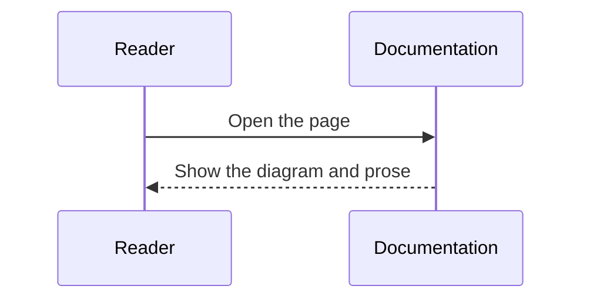

Use these snippets as starting points for new notes. Replace the `title`, `description`, body, and cell IDs before publishing.

## Plain Note

Use this shape when a topic only needs explanation and static code examples.

````md
---
title: Topic name
description: Explain what this note covers in one sentence.
---

Start with the context readers need before the details.

## Background

Explain why this topic matters.

## Example

```rust
fn main() {
    println!("hello");
}
```

## Summary

Summarize the key points.
````

## Executable Note

Use this shape when readers should change parameters and inspect output.

````md
---
title: Computation note
description: A note where readers can change inputs and inspect output.
---

Explain the model or computation before the cell.

```rust
//| id: unique-rust-cell-id
//| title: Calculate with Rust
//| run: reactive
//| crates: []
//| inputs:
//|   value: { type: range, label: value, min: 0, max: 10, step: 1, value: 3 }
println!("value = {value}");
```

Explain what changed in the result and what readers should notice.
````

## Haskell Executable Note

Use this shape for standard-library Haskell examples with text output.

````md
---
title: Haskell note
description: A note where readers can change Haskell inputs and inspect output.
---

Explain the computation before the cell.

```haskell
--| id: unique-haskell-cell-id
--| title: Calculate with Haskell
--| run: reactive
--| inputs:
--|   count: { type: integer, label: count, min: 1, max: 8, step: 1, value: 4 }
import Data.List (intercalate)

let values = take count [1, 3 ..]
putStrLn (intercalate ", " (map show values))
```

Explain what readers should notice in the output.
````

## Diagram Note

Use this shape when structure, states, or sequence matter more than code.

````md
---
title: Diagram note
description: A note that explains structure or flow with Mermaid.
---

Explain how to read the diagram.



Summarize the responsibility split or flow.
````

## Media Note

Use this shape for screenshots, reference images, and supplemental PDFs.

```md
---
title: Media note
description: A note that uses images and PDFs.
---


<iframe class="media-frame" src="/media/examples/sample.pdf" title="Supplemental PDF"></iframe>

[Open the PDF in a new tab](/media/examples/sample.pdf)
```

## Bilingual Page Pair

Use the same route for English and Japanese pages.

```text
content/docs/features/example.mdx
content/docs/ja/features/example.mdx
```

Keep examples and cell IDs aligned unless the translation needs different prose or labels.
