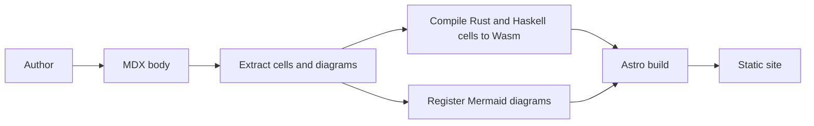
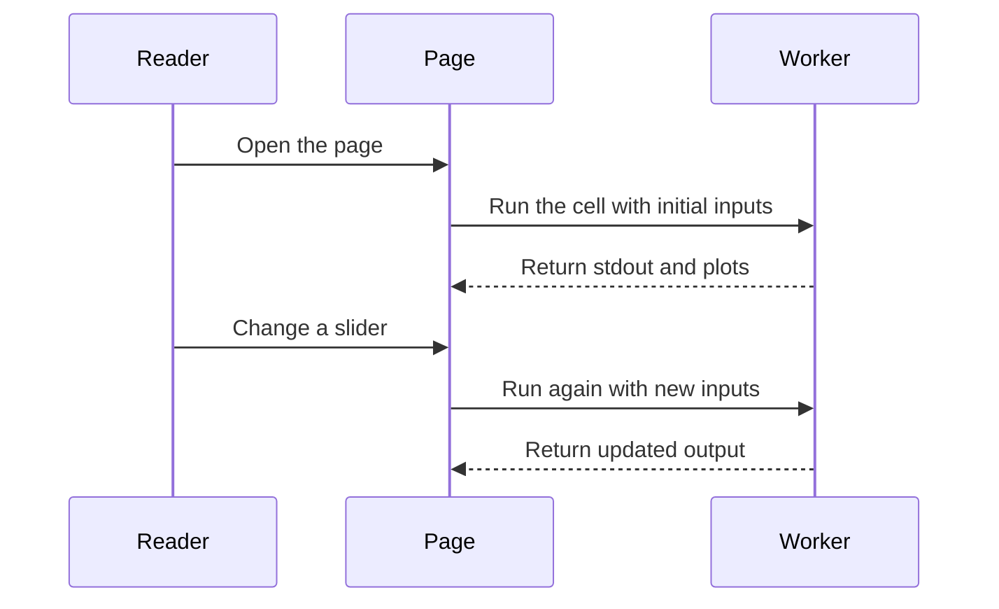
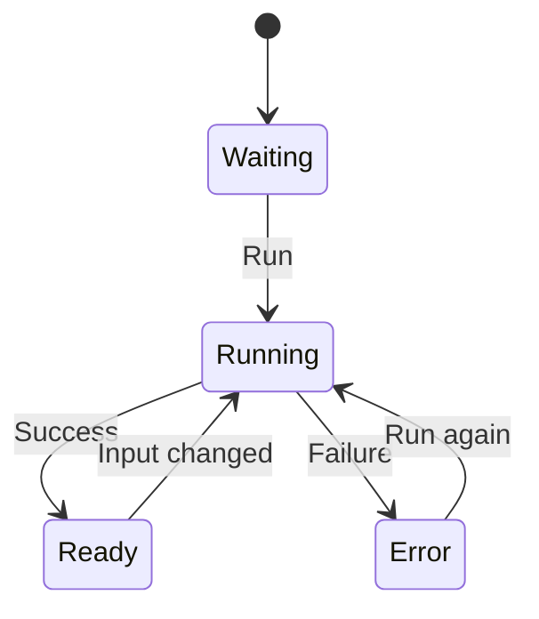

Mermaid は text で図を書く形式です。Oxiquill では fenced `mermaid` block が browser-rendered SVG diagram に変換されます。ページ側で import や custom component は不要です。

## build flow

この flowchart は、本文、実行可能セル、静的サイト生成の関係を示します。

## reader flow

この sequence diagram は、読者がページを開き、input-driven cell を変更する流れを示します。

## cell state

この state diagram は、主な cell UI state を示します。

Mermaid source は repository-owned MDX に置き、信頼できない外部入力を直接 render しないでください。
