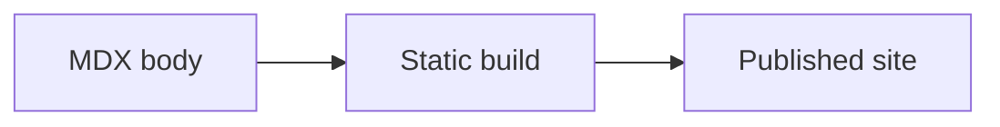

Oxiquill のページは MDX file です。ページは通常の文章ノートにも、実行可能な計算ノートにも、メディア付きの説明にも、その組み合わせにもできます。

## ページを追加する

各ページは Starlight frontmatter から始めます。`title` はページ見出しと sidebar label に使われます。`description` は metadata と検索結果に使われます。

```md
---
title: Page title
description: Explain the page in one sentence.
---

Write the body here.
```

英語ページは `src/content/docs` に追加します。日本語翻訳は同じ route で `src/content/docs/ja` に追加します。primary navigation に出したいページは `astro.config.mjs` の sidebar に追加します。

置き場所の目安:

- `guides/<topic>.mdx`: 作業手順の説明。
- `features/<feature>.mdx`: 機能説明と例。
- `samples/<topic>.mdx`: 完成したサンプルノート。

## 読者向けに書く

最初に、そのページで読者が何をできるようになるかを書き、その後で例に進みます。見出しで目的、構文、動作を分けます。サンプルセルはテスト、スクリーンショット、読者の表示が安定するように deterministic にします。

日本語翻訳は英語版と同じ route と大まかな構成を保ちます。一字一句同じ訳である必要はありませんが、同じ動作と例を扱います。

## Rust セルを書く

Rust セルは `rust` の fenced code block で、先頭に `//|` または `///|` metadata comment を置きます。`id` はページ内で一意にします。英語版と日本語版は同じ local `id` を使えます。build が page-scoped internal ID を作ります。

````md
```rust
//| id: sample-rust-cell
//| title: Rust calculation
//| run: button
//| crates: [doc-rust]
let next = doc_rust::logistic_step(3.2, 0.2);
println!("next = {next:.6}");
```
````

`crates` には `crates/*` 配下の helper crate package name を指定します。共有 Rust ロジックを使わないセルは `crates: []` にします。

## Python セルを書く

Python セルは `python` の fenced code block で、先頭に `#|` metadata comment を置きます。

````md
```python
#| id: sample-python-cell
#| title: Python calculation
#| run: reactive
#| inputs:
#|   scale: { type: number, label: scale, min: 1, max: 10, step: 1, value: 2 }
print(scale * 10)
```
````

Python セルは Pyodide worker で実行されます。vendored package が必要な場合は `packages` に指定します。対応 package には `numpy`、`pandas`、`matplotlib` と、それらの vendored dependency が含まれます。

## セルの動作を設定する

主な metadata field:

- `id`: 必須のページ内 cell ID。
- `title`: cell UI に表示される見出し。
- `run`: `button`、`reactive`、`autorun`、`hidden`。default は `button`。
- `inputs`: cell 内の変数として使える入力 UI。
- `crates`: Rust helper crate。Rust のみ。
- `packages`: Pyodide package。Python のみ。
- `timeoutMs`: 正の millisecond timeout。default は `30000`。
- `showSource`: `false` にすると source を初期状態で隠します。

対応 input type は `range`、`number`、`integer`、`text`、`textarea`、`checkbox`、`select`、`radio` です。

## 数式を追加する

inline math は `$...$`、block math は `$$...$$` で書きます。

```md
The state is $x_n \in [0, 1]$.

$$
x_{n+1} = r x_n (1 - x_n)
$$
```

数式はページ表示時に KaTeX で render されます。

## 図を追加する

Mermaid 図は `mermaid` の fenced block として書きます。import は不要です。

````md

````

Mermaid source は repository-owned MDX に置きます。信頼できない外部入力をそのまま Mermaid に渡さないでください。

## メディアを追加する

PNG、JPEG、PDF など処理せずに配信したい静的 file は `public/media` に置きます。MDX からは `/media/...` URL で参照します。

```md


<iframe class="media-frame" src="/media/examples/sample.pdf" title="Sample PDF"></iframe>

[Open the PDF in a new tab](/media/examples/sample.pdf)
```

画像には具体的な alt text を書きます。PDF は embedded frame だけでなく、直接開ける通常 link も置きます。
