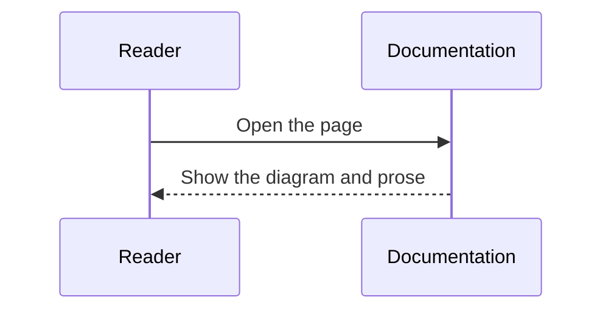

新しいノートを書くときは、近い形の snippet から始めます。公開前に `title`、`description`、本文、cell ID を置き換えてください。

## 通常ノート

説明と静的な code example だけで十分な topic に使います。

````md
---
title: Topic name
description: Explain what this note covers in one sentence.
---

Start with the context readers need before the details.

## Background

Explain why this topic matters.

## Example

```rust
fn main() {
    println!("hello");
}
```

## Summary

Summarize the key points.
````

## 実行可能ノート

読者が parameter を変えて出力を確認する topic に使います。

````md
---
title: Computation note
description: A note where readers can change inputs and inspect output.
---

Explain the model or computation before the cell.

```rust
//| id: unique-rust-cell-id
//| title: Calculate with Rust
//| run: reactive
//| crates: []
//| inputs:
//|   value: { type: range, label: value, min: 0, max: 10, step: 1, value: 3 }
println!("value = {value}");
```

Explain what changed in the result and what readers should notice.
````

## 図解ノート

構造、状態、手順を code よりも図で説明したいときに使います。

````md
---
title: Diagram note
description: A note that explains structure or flow with Mermaid.
---

Explain how to read the diagram.



Summarize the responsibility split or flow.
````

## メディア付きノート

スクリーンショット、参照画像、補足 PDF に使います。

````md
---
title: Media note
description: A note that uses images and PDFs.
---


<iframe class="media-frame" src="/media/examples/sample.pdf" title="Supplemental PDF"></iframe>

[Open the PDF in a new tab](/media/examples/sample.pdf)
````

## 日英ページの組

英語と日本語で同じ route を使います。

```text
content/docs/features/example.mdx
content/docs/ja/features/example.mdx
```

翻訳で文章や label を調整する場合でも、例と cell ID はできるだけ揃えます。
