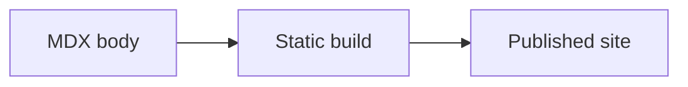

Add notes as MDX files. English pages live in `src/content/docs`, and Japanese translations live in `src/content/docs/ja` with the same slug. In addition to normal Markdown, pages can include Rust/Python executable cells, KaTeX math, Mermaid diagrams, images, and PDFs.

## Preview While Editing

Use `pnpm dev` while writing. It generates the executable-cell runtime on startup, then watches MDX and Rust sources.

```sh
pnpm dev
```

Plain prose, normal code blocks, math, Mermaid diagrams, and media changes are handled by Astro HMR. Python cell changes update only the manifest. Rust cells and `crates/*` changes rebuild the Wasm runtime.

To run Astro and the runtime watcher separately, start these commands in separate terminals:

```sh
pnpm dev:runtime
pnpm dev:astro
```

## Add a Page

Each page starts with Starlight frontmatter. `title` is used for the page heading and sidebar. `description` is used for metadata and search results.

```md
---
title: Page title
description: Explain the page in one sentence.
---

Write the body here.
```

Topic notes work well under `notes/<category>/<slug>.mdx`. Add a page to the sidebar by adding its slug to `astro.config.mjs`.

## Write Rust Cells

Rust cells are `rust` code blocks with `//|` metadata. The `id` must be unique within the page. English and Japanese versions can reuse the same local `id`; the build creates page-scoped internal IDs.

````md
```rust
//| id: sample-rust-cell
//| title: Rust calculation
//| run: button
//| crates: [doc-rust]
let next = doc_rust::logistic_step(3.2, 0.2);
println!("next = {next:.6}");
```
````

Use `crates` to list optional helper crate package names under `crates/*`. Cells that do not need shared Rust logic should use `crates: []`.

## Emit Rich Outputs

Cells can return multiple typed output artifacts. Plain `print` and `println!` still work, and richer outputs render with shared UI components.

Python cells include display helpers:

- `display(value)` chooses JSON, table, image, HTML, or text output from the value.
- `display_json(value)` emits JSON.
- `display_html(html)` emits sandboxed HTML.
- `display_table(rows_or_dataframe)` emits a table.
- `display_image(data, mime)` emits SVG, PNG, or JPEG image data.

Python cells that use vendored packages must list them with `packages`. The current vendored rich-output packages are `matplotlib` and `pandas`.

````md
```python
#| id: pandas-example
#| title: Pandas table
#| packages: [pandas]
import pandas as pd

scores = pd.DataFrame({"label": ["alpha", "beta"], "score": [3, 5]})
display(scores, title="Scores")
```
````

Rust cells use explicit `emit_*` macros. Supported macros include `emit_text!`, `emit_json!`, `emit_html!`, `emit_svg!`, `emit_png_base64!`, `emit_table!`, `emit_table_with_columns!`, `emit_records_table!`, `emit_line_chart!`, `emit_scatter_chart!`, `emit_bar_chart!`, `emit_histogram!`, `emit_heatmap!`, and the compatibility `emit_line_plot!`.

````md
```rust
//| id: rust-output-example
//| title: Rust rich output
//| crates: []
let rows = vec![
    serde_json::json!({"label": "alpha", "score": 3}),
    serde_json::json!({"label": "beta", "score": 5}),
];

emit_json!(&serde_json::json!({"rows": rows.len()}));
emit_records_table!(&rows);
emit_bar_chart!(&["alpha", "beta"], &[3, 5]);
```
````

Large outputs are limited before they reach the UI thread. Text is capped at about 200 KB, JSON and HTML at about 500 KB, images at about 2 MB, and table previews at 1,000 rows.

## Add Inputs

Add `inputs` metadata to let the runtime generate form controls. Supported input types are `range`, `number`, `integer`, `text`, `textarea`, `checkbox`, `select`, and `radio`.

````md
```python
#| id: sample-python-cell
#| title: Python input example
#| run: reactive
#| inputs:
#|   scale: { type: number, label: scale, min: 1, max: 10, step: 1, value: 2 }
#|   label: { type: text, label: label, value: "sample" }
print(f"{label}: {scale * 10}")
```
````

`run` can be `button`, `reactive`, `autorun`, or `hidden`. Use `reactive` when readers should see output update as inputs change. Use `button` when execution should be explicit.

## Add Media

Put unprocessed static files such as PNG, JPEG, and PDF files in `public/media`. Reference them from MDX with `/media/...` URLs.

```md


<iframe class="media-frame" src="/media/examples/sample.pdf" title="Sample PDF"></iframe>
```

Use specific alt text for images. For PDFs, include a regular link as well as an embedded frame so readers can open the file directly.

## Write Mermaid Diagrams

Mermaid diagrams are plain `mermaid` code blocks. No imports are required.

````md

````

Diagrams are rendered as SVG in the browser. Keep Mermaid source in repository-owned MDX and do not pass untrusted external input directly to Mermaid.
