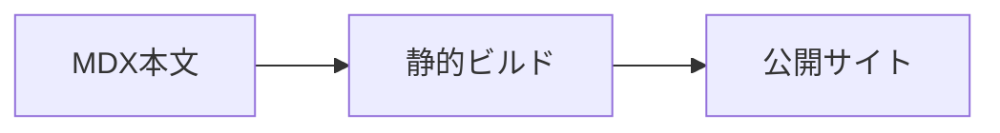

ノートは英語版を `src/content/docs` に、日本語版を `src/content/docs/ja` に MDX ファイルとして追加します。通常の Markdown 記法に加えて、Rust/Python の実行可能セル、KaTeX 数式、Mermaid 図、画像、PDFをそのまま書けます。

## プレビューしながら編集する

編集時は `pnpm dev` を使います。初回に実行可能セルのランタイムを生成し、その後は MDX と Rust ソースを監視します。

```sh
pnpm dev
```

本文、通常のコードブロック、数式、Mermaid 図、メディアだけを変更した場合は Astro の HMR で反映されます。Python セルを変更した場合は manifest だけを更新し、Rust セルや `crates/*` を変更した場合だけ Wasm を再ビルドします。

Astro とランタイム監視を別々に動かしたい場合は、次の2つを別ターミナルで起動します。

```sh
pnpm dev:runtime
pnpm dev:astro
```

## ページを追加する

ページ先頭には Starlight の frontmatter を置きます。`title` はサイドバーやページ見出しに使われ、`description` は検索結果やメタ情報として使われます。

```md
---
title: ページタイトル
description: このページで扱う内容を一文で説明します。
---

本文を書きます。
```

英語がメインの言語です。英語版は `src/content/docs/<slug>.mdx`、日本語版は同じslugで `src/content/docs/ja/<slug>.mdx` に置きます。テーマ別のノートは `notes/<カテゴリ>/<slug>.mdx` に置くと、サンプルや教材を増やしやすくなります。サイドバーへ載せる場合は `astro.config.mjs` の `sidebar` に slug を追加します。

## Rust セルを書く

Rust セルは `rust` のコードブロックに `//|` メタデータを付けます。`id` はページ内で一意にしてください。英語版と日本語版で同じ `id` を使っても、ビルド時にページごとの内部IDへ変換されます。

````md
```rust
//| id: sample-rust-cell
//| title: Rust の計算例
//| run: button
//| crates: [doc-rust]
let next = doc_rust::logistic_step(3.2, 0.2);
println!("next = {next:.6}");
```
````

`crates` には `crates/*` にある任意の helper crate の package 名を指定します。共有ロジックを使わないセルは `crates: []` と書きます。

## 入力を追加する

`inputs` を指定すると、ランタイムがフォーム UI を自動生成します。対応している入力は `range`, `number`, `integer`, `text`, `textarea`, `checkbox`, `select`, `radio` です。

````md
```python
#| id: sample-python-cell
#| title: Python の入力例
#| run: reactive
#| inputs:
#|   scale: { type: number, label: 倍率, min: 1, max: 10, step: 1, value: 2 }
#|   label: { type: text, label: ラベル, value: "sample" }
print(f"{label}: {scale * 10}")
```
````

`run` は `button`, `reactive`, `autorun`, `hidden` を指定できます。読者が値を動かして結果を見るページでは `reactive`、明示的な実行を促したいページでは `button` を使います。

## メディアを追加する

PNG、JPEG、PDFなど、処理せずそのまま配信したいファイルは `public/media` に置きます。MDXからは `/media/...` のURLで参照できます。

```md


<iframe class="media-frame" src="/media/examples/sample.pdf" title="サンプルPDF"></iframe>
```

画像には具体的な代替テキストを付けます。PDFは埋め込みだけでなく、通常のリンクも併記すると読者が別タブで開きやすくなります。

## Mermaid 図を書く

Mermaid は `mermaid` コードブロックとして書きます。追加の import は不要です。

````md

````

図はブラウザで SVG に変換されます。図のソースはこのリポジトリの MDX に限定し、外部入力をそのまま Mermaid に渡さないでください。
