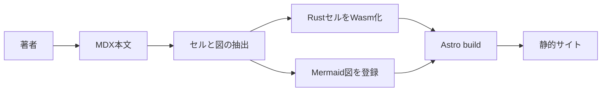
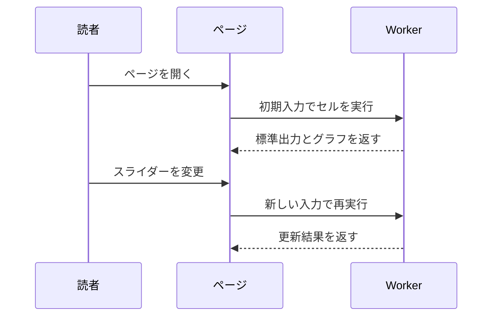
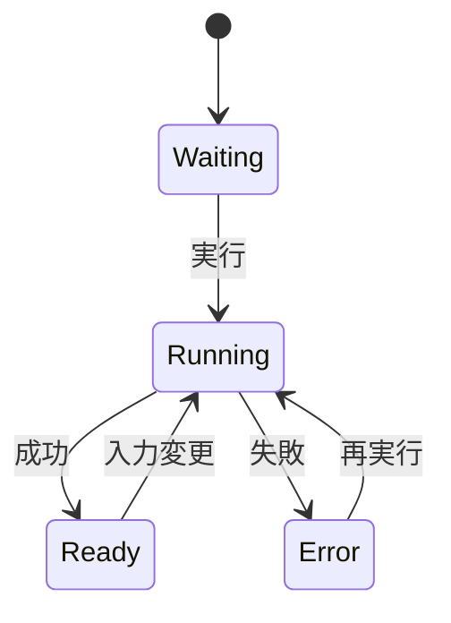

Mermaid は、テキストで書いた図を SVG として表示するための記法です。このテンプレートでは `mermaid` コードブロックを置くだけで、ページ表示時に図へ変換されます。

## ビルドの流れ

ドキュメントの本文、コードセル、静的サイト生成の関係をフローチャートで表した例です。

## 読者操作の流れ

読者がページを開き、入力付きセルを操作する流れをシーケンス図で表します。

## セルの状態

セル UI の状態を状態遷移図で表した例です。

