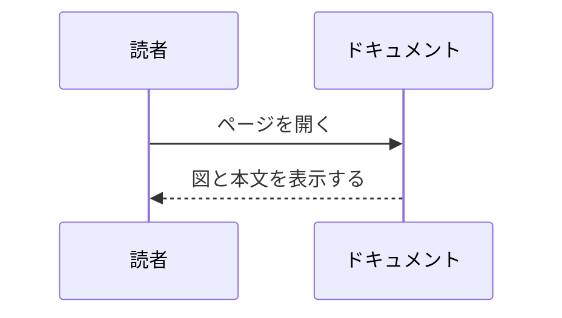

このページは、ノートを増やすときの出発点です。目的に近いひな形を選び、`title`、`description`、本文、セル ID を置き換えて使います。

## 通常ノート

文章とコード例だけで完結するページのひな形です。

````md
---
title: テーマ名
description: このノートで説明する内容を一文で書きます。
---

このノートでは、読者が最初に理解すべき前提を短く説明します。

## 背景

なぜこのテーマが重要なのかを書きます。

## 例

```rust
fn main() {
    println!("hello");
}
```

## まとめ

読者が持ち帰る要点を書きます。
````

## 実行可能セル付きノート

読者がパラメータを変えて結果を確認するページのひな形です。セルの `id` はページ内で一意にします。

````md
---
title: 計算ノート
description: 入力を動かして計算結果を確認するノートです。
---

本文でモデルや計算の前提を説明します。

```rust
//| id: unique-rust-cell-id
//| title: Rust で計算する
//| run: reactive
//| crates: []
//| inputs:
//|   value: { type: range, label: 値, min: 0, max: 10, step: 1, value: 3 }
println!("value = {value}");
```
````

## 図解ノート

手順、状態、責務分担を図で説明するページのひな形です。

````md
---
title: 図解ノート
description: Mermaid 図で構造や流れを説明するノートです。
---

本文で図の読み方を説明します。


````

## メディア付きノート

画像やPDFを本文に置くページのひな形です。

````md
---
title: メディア付きノート
description: 画像やPDFを使うノートです。
---


<iframe class="media-frame" src="/media/examples/sample.pdf" title="補足資料PDF"></iframe>

[PDFを別タブで開く](/media/examples/sample.pdf)
````
