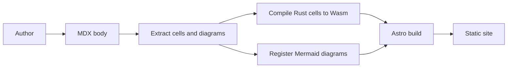
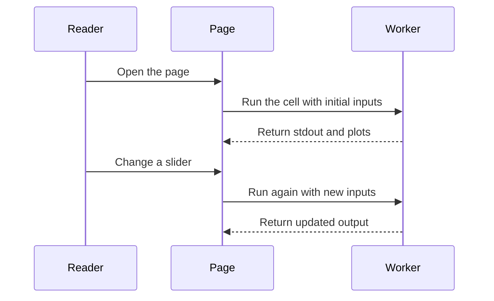
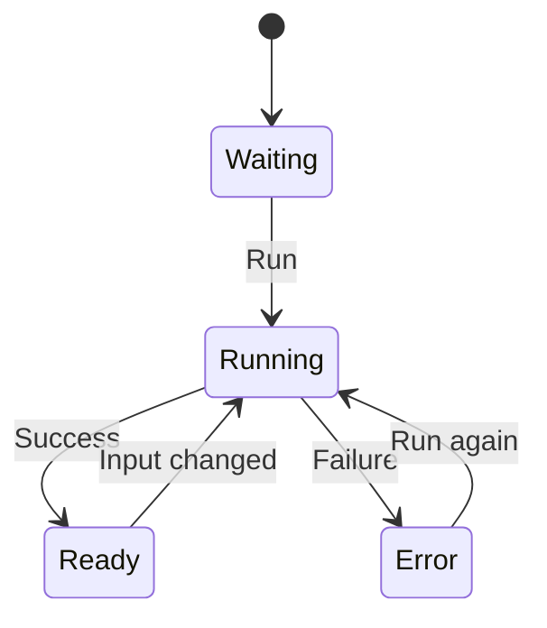

Mermaid is a text format for diagrams rendered as SVG. In this template, a `mermaid` code block is enough; the page converts it into a diagram in the browser.

## Build Flow

This flowchart shows how prose, code cells, and static site generation fit together.

## Reader Flow

This sequence diagram shows how a reader opens a page and changes an input-driven cell.

## Cell States

This state diagram shows the cell UI states.

