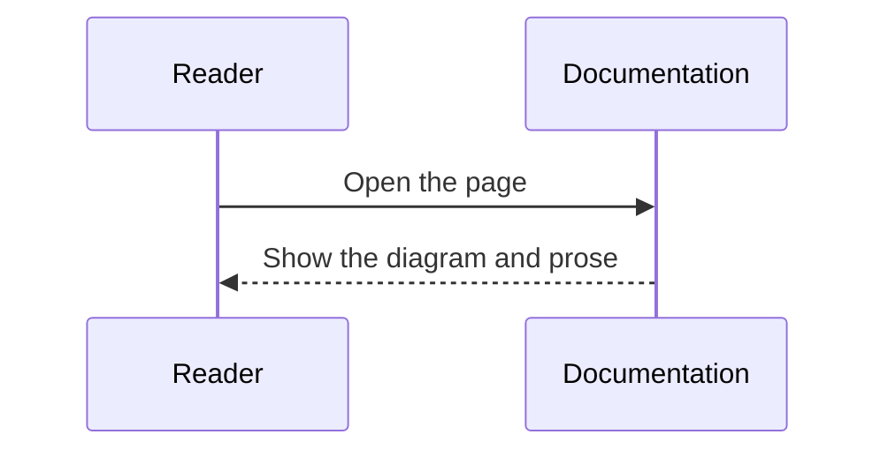

Use these snippets as starting points for new notes. Pick the closest shape and replace the `title`, `description`, body, and cell IDs.

## Plain Note

A note that only needs prose and code examples.

````md
---
title: Topic name
description: Explain what this note covers in one sentence.
---

Start with the context readers need before the details.

## Background

Explain why this topic matters.

## Example

```rust
fn main() {
    println!("hello");
}
```

## Summary

Summarize the key points.
````

## Note With an Executable Cell

A note where readers can change parameters and inspect the result.

````md
---
title: Computation note
description: A note where readers can change inputs and inspect output.
---

Explain the model or computation before the cell.

```rust
//| id: unique-rust-cell-id
//| title: Calculate with Rust
//| run: reactive
//| crates: []
//| inputs:
//|   value: { type: range, label: value, min: 0, max: 10, step: 1, value: 3 }
println!("value = {value}");
```
````

## Diagram Note

A note that explains a process, state, or responsibility split with Mermaid.

````md
---
title: Diagram note
description: A note that explains structure or flow with Mermaid.
---

Explain how to read the diagram.


````

## Media Note

A note that embeds images or a PDF.

````md
---
title: Media note
description: A note that uses images and PDFs.
---


<iframe class="media-frame" src="/media/examples/sample.pdf" title="Supplemental PDF"></iframe>

[Open the PDF in a new tab](/media/examples/sample.pdf)
````
